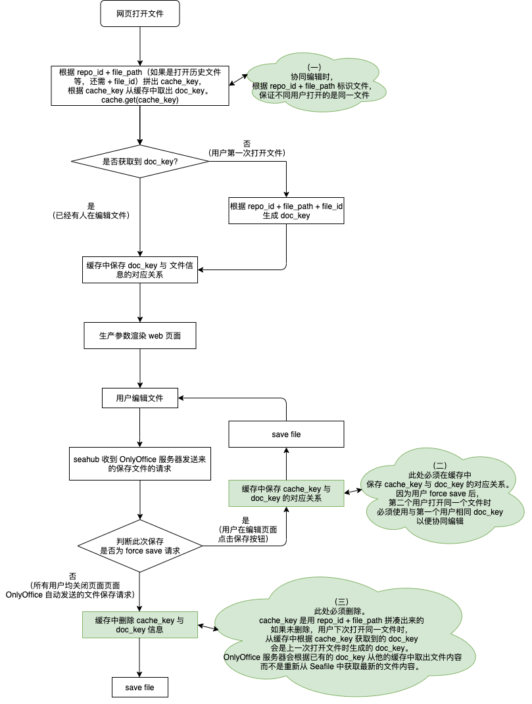

# OnlyOffice

deploy onlyoffice server

## install docker

please see [here](../docker/docker.md#install)

## install nginx

please see [here](../tools/nginx.md#install)

## install certbot

please see [here](../tools/certbot.md#install)

## change nginx conf

```
# for onlyoffice
map $http_x_forwarded_proto $the_scheme {
        default $http_x_forwarded_proto;
        "" $scheme;
}

map $http_x_forwarded_host $the_host {
        default $http_x_forwarded_host;
        "" $host;
}

map $http_upgrade $proxy_connection {
        default upgrade;
        "" close;
}

......

        location / {
            # IMPORTANT ! - Trailing slash !
            proxy_pass http://127.0.0.1:8123/;

            proxy_http_version 1.1;
            client_max_body_size 0; # Limit Document size to 100MB
            proxy_read_timeout 3600s;
            proxy_connect_timeout 3600s;
            proxy_set_header Upgrade $http_upgrade;
            proxy_set_header Connection $proxy_connection;

            # IMPORTANT ! - Subfolder and NO trailing slash !
            proxy_set_header X-Forwarded-Host $the_host;

            proxy_set_header X-Forwarded-Proto $the_scheme;
            proxy_set_header X-Forwarded-For $proxy_add_x_forwarded_for;
        }

```

## docker run

```
sudo docker run -i -t -d -p 8123:80 -e JWT_ENABLED=true -e JWT_SECRET=lian-secret-string --name oods-enable-jwt --restart always onlyoffice/documentserver:6.2
```

## crontab -e

```
30 2 * * 1 certbot renew >> /var/log/le-renew.log
35 2 * * 1 service nginx restart
```

----------


