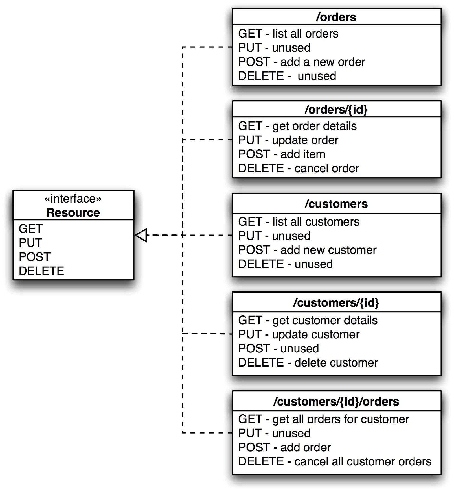
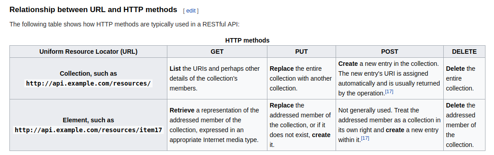

# restful api




## example

from dropbox api

### 批量删除文件

<https://www.dropbox.com/developers/documentation/http/documentation#files-delete_batch>

请求
```
curl -X POST https://api.dropboxapi.com/2/files/delete_batch
```

参数
```
{
    "entries": [
        {
            "path": "/Homework/math/Prime_Numbers.txt"
        }
    ]
}
```

### 批量移动文件

请求
```
curl -X POST https://api.dropboxapi.com/2/files/move_batch

```

参数
```
{
    "entries": [
        {
            "from_path": "/Homework/math",
            "to_path": "/Homework/algebra"
        }
    ],
    "allow_shared_folder": false,
    "autorename": false
}
```

## reference

- <http://www.restapitutorial.com/lessons/whatisrest.html>
- <https://developers.google.com/drive/v3/web/batch>
- <https://developers.facebook.com/docs/graph-api/making-multiple-requests?locale=en_US>
- <https://docs.box.com/reference#files>

