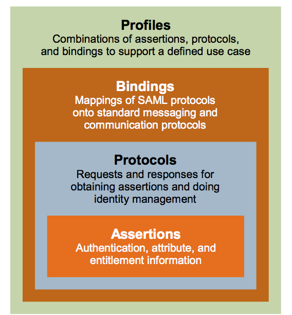

# saml2

saml，Security Assertion Markup Language，安全断言标记语言。

SP，Service Provider 服务提供方。

IdP，Identity Provider 身份认证方。

通过浏览器 GET 或者 POST 请求来转发请求、交互信息。

IAM，Identity and Access Management.

## IDP Metadata.xml

|参数|含义|
|----|----|
|entityID|IdP 唯一标识。 建议使用域名形式，确保全局唯一。取值中要包含“https://”。 示例：https://www.idp.com|
|两个<ds:X509Certificate></ds:X509Certificate>内的值|是一份包含公钥的证书，该证书用于验证签名。为了确保安全性，建议使用长度大于等于2048位的公钥。SP通过IDP元数据文件中的签名证书来确认认证过程中断言消息的可信性、完整性。|
|<md:SingleLogoutService中Location的值|会话注销功能。示例：https://www.idp.com/saml/logout|
|<md:SingleSignOnService中Location的值|IDP处理SAML请求认证的地址，用以接收处理SAMLRequest，并生成SAMLResponse，示例：https://www.idp.com/saml/login|

## 登录流程

未登录时，浏览器会将页面重定向到 IdP，

- HTTP Redirect Binding

    `GET https://win-mi64c2jsv9s.lian.local/adfs/ls/?SAMLRequest=hZJfT8IwFMW%2FytL3raMgCQ0jQQmRBBVlGOPbdStQ0j%2Bz9w7027uBRnzBx%2Fae3z3nNB0iWFPJcU1b96Tea4UUfVjjULaDjNXBSQ%2BoUTqwCiUVcjm%2Bm0uRpBIQVSDtHTtDqstMFTz5whsWjX%2FoG%2B%2BwtiosVdjrQq2e5hnbElUoOS%2BV9QkqWGujEvIVby0EhwI5iyZNWO2g3fFLHLSLre73CrHD%2FQATo8ElxhdgOJRr5KYlZ5OM6TLuUud%2B7w%2Brx13pxealmjYTxFrNHBI4yphIRSdOr%2BLOIE%2F7stuTQryyaPHd4Vq7UrvN5cJvJxHK2zxfxIuHZc6iZxXwGLoRsNGw7SSPxiGa%2BmCBLq9sb5r066NUKkeaPtnonyeziqAEAj7kZ36j0%2BnvBxh9AQ%3D%3D&RelayState=%2F`
    
    Query String Parameters：
    
    1. `SAMLRequest`。
    
    2. `RelayState`，an URL parameter that we use to say to our Identity Provider where he should send the response back。

    下面 **python3-saml-demo-django** 代码示例中，配置 `saml/advanced_settings.json` 中的 `"authnRequestsSigned": True,`，则会使用 `SigAlg` 和 `Signature` 参数。

    `GET https://samltest.id/idp/profile/SAML2/Redirect/SSO?SAMLRequest=fVNNj9owEL3vr4hyBychfFlARaEfSBQikt1DL5WxJ11LiZ3ak13239cObJeVtiSHKOM3b%2Ba9Gc8sq6uGLlt8VAf404LFuyA41ZWytDuah61RVDMrLVWsBkuR03z5Y0uTfkQbo1FzXYXvkm7nMGvBoNTKJ23W83C%2F%2B7Ldf9vsfqWTMZsM4hFPh8ekTOPRMR0Mk%2Bl0cBSpGIppGsNUJCPmEx%2FAWMcxDx2l%2Fw%2BCzOgnKcDsXMV5mGcBOjFdDWtb2CiLTKHDR0nci4a9eFrEEY0GNI1%2BetTaoaVi2JE%2BIjaWEuLVeJq%2BFESKhji9payAeDEJOYCQBjiSPN97iuzixmephFS%2Fb9twPIMs%2FV4UWS%2Fb54WnWL6as9LKtjWYHMyT5HB%2F2J67ck3FybgfuTemk2gyJp8Yt%2BGis2Dm%2B6WdXrP4GF0DMsGQkRm5Br%2BlN9QbuFlnupL8pYv756s2NcP%2FS4pdAR%2BRold2UNoq2wCXpQQR%2FqNZVpV%2BXhlg6GaEpoUwIO%2BKX5YQRLeSzgWEEwYrXTfMSOtnAyfG8SL4TfQ1fFW5HTtAubi5hpxyj3PhzH2etRF%2Bfm6cIArDXPPa4MWkD8nPXZMbbS%2FuXo%2Bv79fiLw%3D%3D&RelayState=http%3A%2F%2F127.0.0.1%3A8087%2F&Signature=DKJ1wQO7FTxrt7mGh6ytws%2B8KvMaM5AdT1Ls3sBM5JSPZOMsCdvCwMWAOkGU8EE1LGtkFrD6mpjI%2B%2FXeejQ03e6LdjrtGCdVp0ht2tunEpsPv2Ia31%2FvSGs39jCBRmTkPOnl21Of8T%2BOnCfmjxs4qhpFX25KX0TxfhK%2BMP9ZXa1XKAcrdiLXC%2B0jNYQth75eCG%2BrvgW53inFfNy6diNdPqM0AjhCVqhSFezuBuw9BJciVXi9T8occUiWFDCOFn8ThjrJOB0eslft2%2Bx5GrKnjr8RO1so7WnSz1N5FIe5Uw0713iXD16BsM9xVHLHbA01E0SIy%2Bz40J3C4XZyhB43Vw%3D%3D&SigAlg=http%3A%2F%2Fwww.w3.org%2F2001%2F04%2Fxmldsig-more%23rsa-sha256`
    
    3. `SigAlg`，可选，签名算法（比如：`http://www.w3.org/2001/04/xmldsig-more#rsa-sha256`）。
    
    4. `Signature`，可选，签名值。SP 发起请求前，会将请求中的 `SAMLRequest={SAMLRequest}&RelayState={RelayState}&SigAlg={SigAlg}` 使用 SP 私钥签名（签名算法为 `SigAlg` 字段指定的算法），之后再做一次 Base64 编码作为签名值。
    
    如果有参数签名的话，IdP 收到请求后通过 SP 公钥（SP Metadata.xml文件中 `<ds:X509Certificate></ds:X509Certificate>` 标签内的值）来验证签名。签名验证通过，则表明是合法 SP 发送的请求可以进行后续操作，否则请求非法。

- HTTP POST Binding

    `POST https://win-mi64c2jsv9s.lian.local/adfs/ls/`

    Form Data:
    
    1. `SAMLRequest`。
    
    2. `RelayState`。

显示 Idp 登录页面，用户登录成功后，IdP 发送 POST 请求（就是一个 HTML form 表单和一段立即提交该表单的 JS 代码）给 SP（AssertionConsumerService）并带上以下参数：

`POST https://demo.seafile.top/saml2/acs/`

Form Data:

1. `SAMLResponse`。

2. `RelayState`，samlRequest中相同参数值。


SP 收到 `SAMLResponse` 后，解析出用户信息，进行后续操作。

## Saml Tech Overview



## Referer

- [Reloading SAML: Do you really need SAML?](https://sagarag.medium.com/reloading-saml-do-you-really-need-saml-931976b3b5e3)
- [Reloading SAML : SAML Basics](https://sagarag.medium.com/reloading-saml-saml-basics-b8999995c73e)
- [华为云 IDP Metadata.xml](https://support.huaweicloud.com/devg-bpconsole/access_00001.html)
- [华为云 saml 认证](https://support.huaweicloud.com/api-bpconsole/jac_00001.html)
- [Authing saml overview](https://docs.authing.cn/v2/concepts/saml/saml-overview.html)

## Tools

- [decode SAML requests](https://developer.pingidentity.com/en/tools/saml-decoder.html)
- <https://developers.onelogin.com/saml/online-tools/x509-certs/obtain-self-signed-certs>

----------

# python3-saml-demo-django

<https://github.com/imwhatiam/python3-saml-demo-django>

1. idp 使用 https://samltest.id/ 提供的服务。也可对接 onelogin 提供的 idp 服务，具体参考：https://developers.onelogin.com/saml/python 。

1. sp 使用 https://github.com/onelogin/python3-saml

## 用法

运行命令（也可下载 Dockerfile 和 settings.json 到同一目录后自行 `docker build -t imwhatiam/python3-saml-demo-django:v1 .`）：

```
docker run -it -p 8000:8000 --name test-saml2 imwhatiam/python3-saml-demo-django:v1 bash
```

进入到容器后，再运行：

```
python3 manage.py runserver 0.0.0.0:8000
```

然后浏览器中访问 http://127.0.0.1:8000/

点击 Login，之后进入到 https://samltest.id/ 的登录界面，按提示输入用户名密码后，即可跳转回本地，并显示已登录用户的信息。 

## 额外说明

### 上传 metadata 到 https://samltest.id/

我已经预先设置好，如 sp 访问地址变了，需要重新上传：

1. 访问 http{s}://new-domain-or-ip/metadata/ 并将 xml 文件下载到本地。
2. 访问 https://samltest.id/upload.php 将 xml 文件上传上去。

### 配置 settings.json

我已预先配置好:

sp 部分使用 onelogin 默认配置 https://github.com/onelogin/python3-saml/blob/master/demo-django/saml/settings.json#L4 ，但注意需要改为自己的域名或IP。

sp 使用自签名证书：`openssl req -new -x509 -days 3652 -nodes -out sp.crt -keyout sp.key`

idp 部分参考 https://samltest.id/download/#SAMLtest%E2%80%99s_IdP

### logout

这部分未配置成功，点击 Logout 后页面显示：

```
Errors:
invalid_response
Reason: The status code of the Response was not Success, was Responder -> unexpected
```

查看 https://samltest.id/logs/idp.log 上的 [log](./logout-error-from-idp.log)，估计是签名、加密的问题，未做进一步调测。
